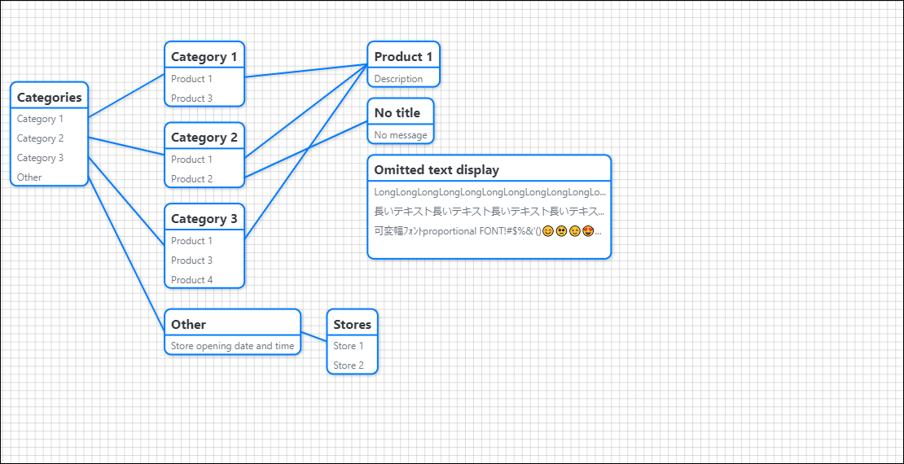
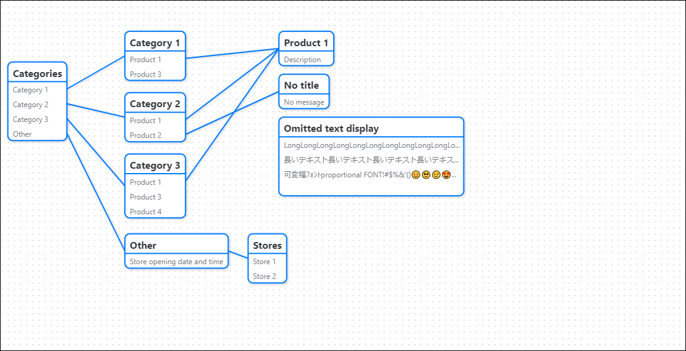
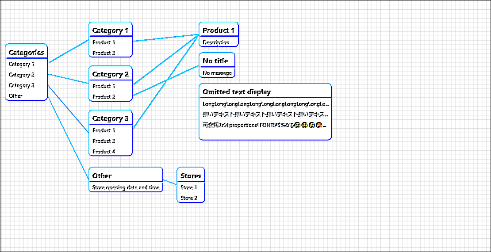

# vue-flowchart
A Mobile-friendly drag and pinchable flowchart components in [Vue.js](https://vuejs.org/).

# demo


This is a demo application combined with [BootstrapVue](https://bootstrap-vue.org/).

# Usage 
## Install via npm
```
npm install @yosichikaw/vue-flowchart
```
## Add to your application
```
import Vue from 'vue';
import VueFlowchart from "@yosichikaw/vue-flowchart";

Vue.use(VueFlowchart);
```

# Example code

```
<template>
  <div id="app">
    <VueFlowchart
      :flow="flow"
      :selected_node_ids="selectedNodeIds"
      :options="options"
      @onTouch="onTouch"
    />
</template>
<script>
export default {
  data() {
    return {
      flow: {
        nodes: [
          {id: 1, title: "title1", bodies: ["item1", "item2"], x: 10, y:500},
          {id: 1, title: "title2", bodies: ["item3"], x: 200, y:700},
        ],
        links: [
          { from: 1, index: 1, to: 2 },
        ],
      },
      selected_nodes: [],
      options:{},
    };
  },
  computed: {
    selectedNodeIds() {
      return this.selected_nodes.map((n) => n.id);
    },
  },
  methods: {
    onTouch({node_id}){
      // do something
    },
  }
};
</script>
```

# Parameters

|Parameter|Default|Type|Description|
|---|---|---|---|
|id|"vue-flowchart"|String| The ID of SVG element.|
|flow|see below|Object|Flowchart display data.|
|selected_node_ids|`[]`|Array|List of IDs of selected nodes.|
|options|see below|Object|Options.|

Define the default Parameters.
https://github.com/IchikawaYoshihiro/vue-flowchart/blob/master/src/const.js

## flow
|Parameter|Type|Default|Description|
|---|---|---|---|
|nodes|Array|`[]`||
|nodes.*.id|String, Number|null||
|nodes.*.title|String|""||
|nodes.*.bodies|Array|`[]`||
|nodes.*.bodies.\*|String|""|Message|
|nodes.*.x|Number|0||
|nodes.*.y|Number|0||
|liks|Array|`[]`||
|liks.*.from|String,Number|0|ID of the source node.|
|liks.*.index|Number|0|The index of the bodies of the linking source node.|
|liks.*.to|String,Number|0|ID of the linked node.|

## selected_node_ids
ID array of the selected node.

## options
|Parameter|Type|Default|Description|
|---|---|---|---|
|draggable|Boolean|true|The value of whether the background can be dragged.|
|pinchable|Boolean|true||
|enable_grid|Boolean|true|The value to display the grid.|
|enable_filter|Boolean|true|Value whether to apply shadow filter, if true, drawing performance will be reduced on low specs.|
|canvas.scale|Number|0.75||
|canvas.grid|Number|10||
|canvas.grid_color|String|"#bbb"||
|node.draggable|Boolean|true|The value of whether the node can be dragged.|
|node.fit_grid|Boolean|true|The value to align to the grid when the node is moved.|
|node.bgcolor|String|"#fff"||
|node.border_color|String|"#40b883"||
|node.border_width|Number|1.5||
|node.max_width|Number|300||
|node.font_size.title|Number|16||
|node.font_size.body|Number|12||
|node.default_text.title|String|"No title"||
|node.default_text.body|String|"No message"||
|node.text_color.title|String|"#111"||
|node.text_color.body|String|"#000"||
|link.border_color|String|"#40b883"||
|link.border_width|Number|1.5||
|link.type|line, key_line, curve|"line"||
|control.detect_double_touch_msec|Number|500|The value of how many milliseconds it is judged to be a double touch when it is touched twice.|
|control.detect_long_touch_msec|Number|500|The value of how many milliseconds or more of continuous touch is judged to be long touch.|
|control.detect_move_px|Number|10|The range of whether you are tapping the same spot. <br>If you make it too small, a slight shift of your finger will be judged as a move and the long tap will not fire.|
|control.drag_fps|Number|60|Drag event firing frequency. <br>If you set it above 120, all movement events will fire, which may result in a performance degradation.|

# Events

|Event|Argments|Description|
|---|---|---|
|onTouch|`{ node_id }`|When touched.|
|onLongTouch|`{ node_id }`|When long-touched.|
|onDoubleTouch|`{ node_id }`|When touched twice.|
|onTouchEnd|`{ node_id }`|When the touch is over.|
|onDrag|`{ dx, dy }`|When draggable is enabled and the cursor is moved.|
|onBackgroundDrag|`{ dx, dy }`|When draggable is enabled and the cursor is moved  in a blank space.|
|onPinch|`{ dr, dh, dv, dl, cx, cy }`|When pinching or mouse wheel is used.<br>`dr`: Rotation angle. <br>`dh`, `dv` : Difference between horizontal and vertical movement.<br>`dl`: Difference in touch distance or wheel travel distance.<br> `cx`,`cy`: Touch intermediate coordinates or wheeled coordinates.|


# Slots
## grid
Custom grids can be added.
If enable_grid is disabled, it is not visible.
The ID of the pattern element must be specified as "grid".

### Example
Dotted Grid.
```
<VueFlowchart>
  <template v-slot:grid="{ options, gridScale }">
    <defs>
      <pattern
        id="grid"
        x="0"
        y="0"
        :width="gridScale.x"
        :height="gridScale.y"
      >
        <circle cx="0" cy="0" r="1" :stroke="options.canvas.grid_color" />
      </pattern>
    </defs>
  </template>
</VueFlowchart>
```


## filter
Allows you to add a custom filter.
Not visible if enable_filter is disabled.
The ID of the pattern element must be specified as "filter".

### Example
An embossable filter sample.
```
<VueFlowchart>
  <template v-slot:filter">
    <defs>
      <filter id="filter">
        <feConvolveMatrix order="3 3" kernelMatrix="3 0 0 0 1 0 0 0 -3" />
      </filter>
    </defs>
  </template>
</VueFlowchart>
```



# Change Log

[CHANGELOG.md](./CHANGELOG.md)